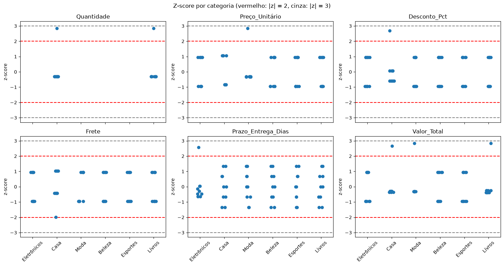
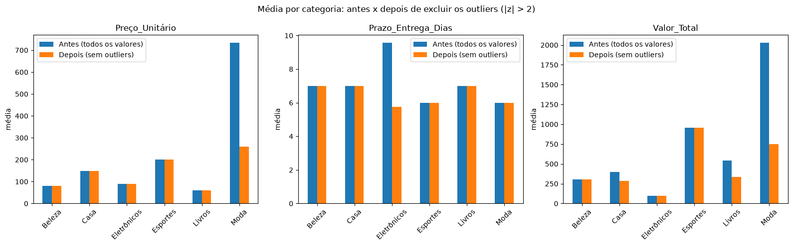

<div align="center">

# Z-Score na Mineração de Dados
### Detecção de outliers e imputação de dados faltantes em vendas virtuais

**FATEC · 6º semestre · Mineração de Dados**

**Professor:** Carlos Feichas

</div>

**Integrantes:**

| | |
|---|---|
| Andre Salerno | Guilherme Benedito |
| Eric Lourenço | Brenno Rosa |
| Karen Gonçalves | Ivan Surita |

---

# Z-Score: breve histórico conceitual

O **z-score** (ou escore padrão) indica quantos desvios padrão um valor está afastado da média:

$$z = \frac{x - \mu}{\sigma}$$

Ele coloca dados de escalas diferentes numa mesma régua, o que o torna útil tanto em estatística quanto em mineração de dados.

## 1. Origens (séculos XVIII e XIX)
- A base é a **distribuição normal**, formalizada por De Moivre (1733), Laplace e principalmente **Gauss** (~1809), no estudo de erros de medição astronômica.
- A ideia central: muitos fenômenos se agrupam em torno de uma média com dispersão previsível.

## 2. Padronização (final do século XIX ao início do XX)
- **Karl Pearson** introduziu o termo *desvio padrão* (1894) e consolidou a estatística moderna.
- Surgiu a noção de medir a distância de um valor à média em unidades de desvio padrão, ou seja, o z-score.
- Isso permite comparar valores de escalas diferentes, como notas e alturas, em uma régua comum.

## 3. Popularização (século XX)
- As **tabelas da normal padrão (tabela Z)** viraram ferramenta clássica de testes de hipótese e intervalos de confiança.
- **Fisher**, Neyman e Pearson consolidaram a inferência estatística, e o z-score passou a ser a base do teste Z.
- Na psicometria e na educação, ele deu origem a escalas derivadas, como QI, T-score e notas padronizadas.

## 4. Uso industrial e financeiro
- **Controle estatístico de processos** (Shewhart, anos 1920): os limites de controle de ±3σ são, na prática, z-scores.
- Em 1968, **Edward Altman** criou o "Altman Z-Score", que prevê falência de empresas. O nome é parecido, mas é um modelo distinto, que combina índices financeiros.

## 5. Era da mineração de dados e do machine learning
- O z-score virou técnica-padrão de **pré-processamento** (padronização de atributos, como o `StandardScaler`). Ele evita que variáveis de escala maior dominem algoritmos baseados em distância ou gradiente, como KNN, K-Means, SVM e regressão.
- Também é muito usado na **detecção de outliers**: valores com |z| > 3 (ou 2,5) costumam ser tratados como atípicos.

## 6. Limitações reconhecidas
- Assume distribuição aproximadamente normal.
- Média e desvio padrão são sensíveis a outliers. Isso motivou alternativas, como o **z-score modificado** (baseado na mediana e no MAD, de Iglewicz e Hoaglin, 1993) e a normalização robusta.

## 7. Tratamento dos dados

### Dicionário de dados

Base `trabalho-vendas-virtuais.xlsx` (aba `Base_Vendas`): 60 pedidos de vendas online, de 03/01/2026 a 01/05/2026, com 12 colunas.

| Coluna | Tipo | Descrição | Valores / observações |
|---|---|---|---|
| `ID_Pedido` | inteiro | Identificador único do pedido | 1001 a 1060 |
| `Data_Pedido` | data | Data em que o pedido foi feito | 03/01/2026 a 01/05/2026 |
| `Categoria` | texto | Categoria do produto vendido | Eletrônicos, Casa, Moda, Beleza, Esportes, Livros (10 pedidos cada) |
| `Região` | texto | Região do Brasil de destino da entrega | Sudeste, Nordeste, Norte, Sul, Centro-Oeste |
| `Forma_Pagamento` | texto | Meio de pagamento usado | Cartão de crédito, PIX, Boleto, Carteira digital. **1 faltante** |
| `Quantidade` | inteiro | Número de unidades compradas no pedido | 1 a 40 |
| `Preço_Unitário` | decimal | Preço de uma unidade, em R$ | 49,90 a 4.999,90. **1 faltante** |
| `Desconto_Pct` | decimal | Desconto aplicado, como fração (0,05 = 5%) | 0, 0,05, 0,10, 0,15 e 0,55 |
| `Frete` | decimal | Valor do frete, em R$ | 0, 12,90, 18,50 e 24,90 |
| `Prazo_Entrega_Dias` | decimal | Prazo de entrega, em dias | 2 a 40. **1 faltante** |
| `Valor_Total` | decimal | Valor final do pedido, em R$ | `Quantidade × Preço_Unitário × (1 − Desconto_Pct) + Frete`. **1 faltante** |
| `Situação_Anormal` | texto | Rótulo indicando se o pedido é normal ou uma anomalia inserida na base | Normal (56 pedidos) ou 4 tipos de anomalia (1 pedido cada): quantidade extrema, preço extremo, atraso extremo e combinada (quantidade alta + desconto alto + frete zero) |

> A coluna `Situação_Anormal` não entra nos cálculos: usamos apenas para conferir se o z-score encontra as anomalias.


```python
import sys; print(sys.executable)

```

    d:\pessoal\fatec\6-sem\mineracao\z-score\.venv\Scripts\python.exe
    


```python
import pandas as pd

df_vdas_vrt = pd.read_excel("trabalho-vendas-virtuais.xlsx")

print(df_vdas_vrt.head(10))
```

       ID_Pedido Data_Pedido    Categoria        Região    Forma_Pagamento  \
    0       1001  2026-01-03  Eletrônicos       Sudeste  Cartão de crédito   
    1       1002  2026-01-05         Casa      Nordeste                PIX   
    2       1003  2026-01-07         Moda         Norte             Boleto   
    3       1004  2026-01-09       Beleza           Sul   Carteira digital   
    4       1005  2026-01-11     Esportes  Centro-Oeste  Cartão de crédito   
    5       1006  2026-01-13       Livros       Sudeste                PIX   
    6       1007  2026-01-15  Eletrônicos      Nordeste             Boleto   
    7       1008  2026-01-17         Casa         Norte   Carteira digital   
    8       1009  2026-01-19         Moda           Sul  Cartão de crédito   
    9       1010  2026-01-21       Beleza  Centro-Oeste                PIX   
    
       Quantidade  Preço_Unitário  Desconto_Pct  Frete  Prazo_Entrega_Dias  \
    0           1            79.9          0.00    0.0                 2.0   
    1           2           139.9          0.05   12.9                 5.0   
    2           3           269.9          0.10   18.5                 8.0   
    3           4            89.9          0.15   24.9                11.0   
    4           5           189.9          0.00    0.0                 4.0   
    5           6            49.9          0.05   12.9                 7.0   
    6           1            99.9          0.10   18.5                10.0   
    7           2           159.9          0.15   24.9                 3.0   
    8           3           249.9          0.00    0.0                 6.0   
    9           4            69.9          0.05   12.9                 9.0   
    
       Valor_Total Situação_Anormal  
    0        79.90           Normal  
    1       278.71           Normal  
    2       747.23           Normal  
    3       330.56           Normal  
    4       949.50           Normal  
    5       297.33           Normal  
    6       108.41           Normal  
    7       296.73           Normal  
    8       749.70           Normal  
    9       278.52           Normal  
    


```python
df_vdas_vrt.info()
```

    <class 'pandas.DataFrame'>
    RangeIndex: 60 entries, 0 to 59
    Data columns (total 12 columns):
     #   Column              Non-Null Count  Dtype         
    ---  ------              --------------  -----         
     0   ID_Pedido           60 non-null     int64         
     1   Data_Pedido         60 non-null     datetime64[us]
     2   Categoria           60 non-null     str           
     3   Região              60 non-null     str           
     4   Forma_Pagamento     59 non-null     str           
     5   Quantidade          60 non-null     int64         
     6   Preço_Unitário      59 non-null     float64       
     7   Desconto_Pct        60 non-null     float64       
     8   Frete               60 non-null     float64       
     9   Prazo_Entrega_Dias  59 non-null     float64       
     10  Valor_Total         59 non-null     float64       
     11  Situação_Anormal    60 non-null     str           
    dtypes: datetime64[us](1), float64(5), int64(2), str(4)
    memory usage: 5.8 KB
    


```python
# nome colunas

df_vdas_vrt.columns
```


    Index(['ID_Pedido', 'Data_Pedido', 'Categoria', 'Região', 'Forma_Pagamento',
           'Quantidade', 'Preço_Unitário', 'Desconto_Pct', 'Frete',
           'Prazo_Entrega_Dias', 'Valor_Total', 'Situação_Anormal'],
          dtype='str')


```python
# quantidade de linhas e colunas
df_vdas_vrt.shape
```


    (60, 12)


```python
#breves estatísticas
df_vdas_vrt.describe()
```


<div>
<style scoped>
    .dataframe tbody tr th:only-of-type {
        vertical-align: middle;
    }

    .dataframe tbody tr th {
        vertical-align: top;
    }

    .dataframe thead th {
        text-align: right;
    }
</style>
<table border="1" class="dataframe">
  <thead>
    <tr style="text-align: right;">
      <th></th>
      <th>ID_Pedido</th>
      <th>Data_Pedido</th>
      <th>Quantidade</th>
      <th>Preço_Unitário</th>
      <th>Desconto_Pct</th>
      <th>Frete</th>
      <th>Prazo_Entrega_Dias</th>
      <th>Valor_Total</th>
    </tr>
  </thead>
  <tbody>
    <tr>
      <th>count</th>
      <td>60.000000</td>
      <td>60</td>
      <td>60.000000</td>
      <td>59.000000</td>
      <td>60.000000</td>
      <td>60.000000</td>
      <td>59.000000</td>
      <td>59.000000</td>
    </tr>
    <tr>
      <th>mean</th>
      <td>1030.500000</td>
      <td>2026-03-03 00:00:00</td>
      <td>4.333333</td>
      <td>219.730508</td>
      <td>0.081667</td>
      <td>13.660000</td>
      <td>7.050847</td>
      <td>725.389661</td>
    </tr>
    <tr>
      <th>min</th>
      <td>1001.000000</td>
      <td>2026-01-03 00:00:00</td>
      <td>1.000000</td>
      <td>49.900000</td>
      <td>0.000000</td>
      <td>0.000000</td>
      <td>2.000000</td>
      <td>79.900000</td>
    </tr>
    <tr>
      <th>25%</th>
      <td>1015.750000</td>
      <td>2026-02-01 12:00:00</td>
      <td>2.000000</td>
      <td>74.900000</td>
      <td>0.037500</td>
      <td>0.000000</td>
      <td>4.000000</td>
      <td>278.615000</td>
    </tr>
    <tr>
      <th>50%</th>
      <td>1030.500000</td>
      <td>2026-03-03 00:00:00</td>
      <td>4.000000</td>
      <td>99.900000</td>
      <td>0.075000</td>
      <td>12.900000</td>
      <td>7.000000</td>
      <td>330.560000</td>
    </tr>
    <tr>
      <th>75%</th>
      <td>1045.250000</td>
      <td>2026-04-01 12:00:00</td>
      <td>5.000000</td>
      <td>199.900000</td>
      <td>0.112500</td>
      <td>18.500000</td>
      <td>9.000000</td>
      <td>749.700000</td>
    </tr>
    <tr>
      <th>max</th>
      <td>1060.000000</td>
      <td>2026-05-01 00:00:00</td>
      <td>40.000000</td>
      <td>4999.900000</td>
      <td>0.550000</td>
      <td>24.900000</td>
      <td>40.000000</td>
      <td>13518.230000</td>
    </tr>
    <tr>
      <th>std</th>
      <td>17.464249</td>
      <td>NaN</td>
      <td>5.316003</td>
      <td>637.050021</td>
      <td>0.082835</td>
      <td>9.310377</td>
      <td>5.247080</td>
      <td>1742.135445</td>
    </tr>
  </tbody>
</table>
</div>


```python
# colunas com dados faltantes
faltantes = df_vdas_vrt.isna().sum()
faltantes = faltantes[faltantes > 0].to_frame("qtd_faltantes")
faltantes["pct_faltantes %"] = (faltantes["qtd_faltantes"] / len(df_vdas_vrt) * 100).round(2)

faltantes
```


<div>
<style scoped>
    .dataframe tbody tr th:only-of-type {
        vertical-align: middle;
    }

    .dataframe tbody tr th {
        vertical-align: top;
    }

    .dataframe thead th {
        text-align: right;
    }
</style>
<table border="1" class="dataframe">
  <thead>
    <tr style="text-align: right;">
      <th></th>
      <th>qtd_faltantes</th>
      <th>pct_faltantes %</th>
    </tr>
  </thead>
  <tbody>
    <tr>
      <th>Forma_Pagamento</th>
      <td>1</td>
      <td>1.67</td>
    </tr>
    <tr>
      <th>Preço_Unitário</th>
      <td>1</td>
      <td>1.67</td>
    </tr>
    <tr>
      <th>Prazo_Entrega_Dias</th>
      <td>1</td>
      <td>1.67</td>
    </tr>
    <tr>
      <th>Valor_Total</th>
      <td>1</td>
      <td>1.67</td>
    </tr>
  </tbody>
</table>
</div>


```python
# linhas que possuem algum dado faltante
df_vdas_vrt[df_vdas_vrt.isna().any(axis=1)]
```


<div>
<style scoped>
    .dataframe tbody tr th:only-of-type {
        vertical-align: middle;
    }

    .dataframe tbody tr th {
        vertical-align: top;
    }

    .dataframe thead th {
        text-align: right;
    }
</style>
<table border="1" class="dataframe">
  <thead>
    <tr style="text-align: right;">
      <th></th>
      <th>ID_Pedido</th>
      <th>Data_Pedido</th>
      <th>Categoria</th>
      <th>Região</th>
      <th>Forma_Pagamento</th>
      <th>Quantidade</th>
      <th>Preço_Unitário</th>
      <th>Desconto_Pct</th>
      <th>Frete</th>
      <th>Prazo_Entrega_Dias</th>
      <th>Valor_Total</th>
      <th>Situação_Anormal</th>
    </tr>
  </thead>
  <tbody>
    <tr>
      <th>19</th>
      <td>1020</td>
      <td>2026-02-10</td>
      <td>Casa</td>
      <td>Centro-Oeste</td>
      <td>Carteira digital</td>
      <td>2</td>
      <td>NaN</td>
      <td>0.15</td>
      <td>24.9</td>
      <td>9.0</td>
      <td>NaN</td>
      <td>Normal</td>
    </tr>
    <tr>
      <th>35</th>
      <td>1036</td>
      <td>2026-03-14</td>
      <td>Livros</td>
      <td>Sudeste</td>
      <td>NaN</td>
      <td>6</td>
      <td>69.9</td>
      <td>0.15</td>
      <td>24.9</td>
      <td>7.0</td>
      <td>381.39</td>
      <td>Normal</td>
    </tr>
    <tr>
      <th>48</th>
      <td>1049</td>
      <td>2026-04-09</td>
      <td>Eletrônicos</td>
      <td>Sul</td>
      <td>Cartão de crédito</td>
      <td>1</td>
      <td>79.9</td>
      <td>0.00</td>
      <td>0.0</td>
      <td>NaN</td>
      <td>79.90</td>
      <td>Normal</td>
    </tr>
  </tbody>
</table>
</div>


### Z-score por categoria para identificar outliers antes da imputação

Antes de calcular a média que vai preencher os faltantes, aplicamos o z-score **dentro de cada categoria** para localizar valores extremos, que distorceriam essa média.

$$z = \frac{x - \bar{x}_{categoria}}{s_{categoria}}$$

Cada categoria tem apenas 10 pedidos. Com esse tamanho, o z-score máximo possível é ≈ 2,85, então o limite clássico de |z| > 3 nunca dispararia. Os gráficos abaixo ajudam a escolher o limite.


```python
colunas_z = ["Quantidade", "Preço_Unitário", "Desconto_Pct", "Frete", "Prazo_Entrega_Dias", "Valor_Total"]

# z-score dentro de cada categoria (NaN é ignorado no cálculo da média e do desvio padrão)
df_z = df_vdas_vrt.groupby("Categoria")[colunas_z].transform(lambda s: (s - s.mean()) / s.std())

# quantos valores seriam marcados como outlier em cada limite
limites = [2, 2.5, 3]
pd.DataFrame({f"|z| > {l}": (df_z.abs() > l).sum() for l in limites})
```


<div>
<style scoped>
    .dataframe tbody tr th:only-of-type {
        vertical-align: middle;
    }

    .dataframe tbody tr th {
        vertical-align: top;
    }

    .dataframe thead th {
        text-align: right;
    }
</style>
<table border="1" class="dataframe">
  <thead>
    <tr style="text-align: right;">
      <th></th>
      <th>|z| &gt; 2</th>
      <th>|z| &gt; 2.5</th>
      <th>|z| &gt; 3</th>
    </tr>
  </thead>
  <tbody>
    <tr>
      <th>Quantidade</th>
      <td>2</td>
      <td>2</td>
      <td>0</td>
    </tr>
    <tr>
      <th>Preço_Unitário</th>
      <td>1</td>
      <td>1</td>
      <td>0</td>
    </tr>
    <tr>
      <th>Desconto_Pct</th>
      <td>1</td>
      <td>1</td>
      <td>0</td>
    </tr>
    <tr>
      <th>Frete</th>
      <td>0</td>
      <td>0</td>
      <td>0</td>
    </tr>
    <tr>
      <th>Prazo_Entrega_Dias</th>
      <td>1</td>
      <td>1</td>
      <td>0</td>
    </tr>
    <tr>
      <th>Valor_Total</th>
      <td>3</td>
      <td>3</td>
      <td>0</td>
    </tr>
  </tbody>
</table>
</div>


```python
import matplotlib.pyplot as plt
import seaborn as sns

# z-score de cada pedido por categoria; linha vermelha = |z| = 2, linha cinza = |z| = 3
fig, axes = plt.subplots(2, 3, figsize=(15, 8), sharex=True)
for ax, col in zip(axes.flat, colunas_z):
    sns.stripplot(x=df_vdas_vrt["Categoria"], y=df_z[col], ax=ax, size=7)
    for lim, cor in [(2, "red"), (3, "gray")]:
        ax.axhline(lim, color=cor, ls="--")
        ax.axhline(-lim, color=cor, ls="--")
    ax.set_title(col)
    ax.set_xlabel("")
    ax.set_ylabel("z-score")
    ax.tick_params(axis="x", rotation=45)

fig.suptitle("Z-score por categoria (vermelho: |z| = 2, cinza: |z| = 3)")
plt.tight_layout()
plt.show()
```


    

    


```python
# limite escolhido: |z| > 2 (com 10 pedidos por categoria, |z| > 3 não detecta nada)
LIMITE_Z = 2
mask_outlier = df_z.abs() > LIMITE_Z

# pedidos com algum valor outlier, ao lado da coluna Situação_Anormal para conferência
df_vdas_vrt.loc[mask_outlier.any(axis=1), ["ID_Pedido", "Categoria", "Situação_Anormal"]].join(df_z.round(2))
```


<div>
<style scoped>
    .dataframe tbody tr th:only-of-type {
        vertical-align: middle;
    }

    .dataframe tbody tr th {
        vertical-align: top;
    }

    .dataframe thead th {
        text-align: right;
    }
</style>
<table border="1" class="dataframe">
  <thead>
    <tr style="text-align: right;">
      <th></th>
      <th>ID_Pedido</th>
      <th>Categoria</th>
      <th>Situação_Anormal</th>
      <th>Quantidade</th>
      <th>Preço_Unitário</th>
      <th>Desconto_Pct</th>
      <th>Frete</th>
      <th>Prazo_Entrega_Dias</th>
      <th>Valor_Total</th>
    </tr>
  </thead>
  <tbody>
    <tr>
      <th>11</th>
      <td>1012</td>
      <td>Livros</td>
      <td>Anomalia: quantidade extrema</td>
      <td>2.85</td>
      <td>0.95</td>
      <td>0.95</td>
      <td>0.95</td>
      <td>-0.67</td>
      <td>2.84</td>
    </tr>
    <tr>
      <th>26</th>
      <td>1027</td>
      <td>Moda</td>
      <td>Anomalia: preço extremo</td>
      <td>NaN</td>
      <td>2.85</td>
      <td>0.95</td>
      <td>0.95</td>
      <td>1.34</td>
      <td>2.85</td>
    </tr>
    <tr>
      <th>42</th>
      <td>1043</td>
      <td>Eletrônicos</td>
      <td>Anomalia: atraso extremo</td>
      <td>NaN</td>
      <td>0.95</td>
      <td>0.95</td>
      <td>0.95</td>
      <td>2.58</td>
      <td>0.95</td>
    </tr>
    <tr>
      <th>55</th>
      <td>1056</td>
      <td>Casa</td>
      <td>Anomalia combinada: quantidade alta + desconto...</td>
      <td>2.85</td>
      <td>1.05</td>
      <td>2.69</td>
      <td>-1.98</td>
      <td>0.00</td>
      <td>2.67</td>
    </tr>
  </tbody>
</table>
</div>


```python
# comparação das médias por categoria: antes (todos os valores) x depois (sem os outliers do z-score)
colunas_imputadas = ["Preço_Unitário", "Prazo_Entrega_Dias", "Valor_Total"]

media_antes = df_vdas_vrt.groupby("Categoria")[colunas_imputadas].mean()
media_depois = df_vdas_vrt[colunas_imputadas].mask(mask_outlier[colunas_imputadas]).groupby(df_vdas_vrt["Categoria"]).mean()

comparativo = pd.concat(
    {"Média antes": media_antes.stack(), "Média depois": media_depois.stack()},
    axis=1,
)
comparativo["Diferença"] = comparativo["Média depois"] - comparativo["Média antes"]
comparativo["Variação %"] = comparativo["Diferença"] / comparativo["Média antes"] * 100
comparativo.index.names = ["Categoria", "Coluna"]

comparativo.round(2)
```


<div>
<style scoped>
    .dataframe tbody tr th:only-of-type {
        vertical-align: middle;
    }

    .dataframe tbody tr th {
        vertical-align: top;
    }

    .dataframe thead th {
        text-align: right;
    }
</style>
<table border="1" class="dataframe">
  <thead>
    <tr style="text-align: right;">
      <th></th>
      <th></th>
      <th>Média antes</th>
      <th>Média depois</th>
      <th>Diferença</th>
      <th>Variação %</th>
    </tr>
    <tr>
      <th>Categoria</th>
      <th>Coluna</th>
      <th></th>
      <th></th>
      <th></th>
      <th></th>
    </tr>
  </thead>
  <tbody>
    <tr>
      <th rowspan="3" valign="top">Beleza</th>
      <th>Preço_Unitário</th>
      <td>79.90</td>
      <td>79.90</td>
      <td>0.00</td>
      <td>0.00</td>
    </tr>
    <tr>
      <th>Prazo_Entrega_Dias</th>
      <td>7.00</td>
      <td>7.00</td>
      <td>0.00</td>
      <td>0.00</td>
    </tr>
    <tr>
      <th>Valor_Total</th>
      <td>304.54</td>
      <td>304.54</td>
      <td>0.00</td>
      <td>0.00</td>
    </tr>
    <tr>
      <th rowspan="3" valign="top">Casa</th>
      <th>Preço_Unitário</th>
      <td>148.79</td>
      <td>148.79</td>
      <td>0.00</td>
      <td>0.00</td>
    </tr>
    <tr>
      <th>Prazo_Entrega_Dias</th>
      <td>7.00</td>
      <td>7.00</td>
      <td>0.00</td>
      <td>0.00</td>
    </tr>
    <tr>
      <th>Valor_Total</th>
      <td>397.66</td>
      <td>285.47</td>
      <td>-112.19</td>
      <td>-28.21</td>
    </tr>
    <tr>
      <th rowspan="3" valign="top">Eletrônicos</th>
      <th>Preço_Unitário</th>
      <td>89.90</td>
      <td>89.90</td>
      <td>0.00</td>
      <td>0.00</td>
    </tr>
    <tr>
      <th>Prazo_Entrega_Dias</th>
      <td>9.56</td>
      <td>5.75</td>
      <td>-3.81</td>
      <td>-39.83</td>
    </tr>
    <tr>
      <th>Valor_Total</th>
      <td>94.16</td>
      <td>94.16</td>
      <td>0.00</td>
      <td>0.00</td>
    </tr>
    <tr>
      <th rowspan="3" valign="top">Esportes</th>
      <th>Preço_Unitário</th>
      <td>199.90</td>
      <td>199.90</td>
      <td>0.00</td>
      <td>0.00</td>
    </tr>
    <tr>
      <th>Prazo_Entrega_Dias</th>
      <td>6.00</td>
      <td>6.00</td>
      <td>0.00</td>
      <td>0.00</td>
    </tr>
    <tr>
      <th>Valor_Total</th>
      <td>956.28</td>
      <td>956.28</td>
      <td>0.00</td>
      <td>0.00</td>
    </tr>
    <tr>
      <th rowspan="3" valign="top">Livros</th>
      <th>Preço_Unitário</th>
      <td>59.90</td>
      <td>59.90</td>
      <td>0.00</td>
      <td>0.00</td>
    </tr>
    <tr>
      <th>Prazo_Entrega_Dias</th>
      <td>7.00</td>
      <td>7.00</td>
      <td>0.00</td>
      <td>0.00</td>
    </tr>
    <tr>
      <th>Valor_Total</th>
      <td>541.37</td>
      <td>334.69</td>
      <td>-206.68</td>
      <td>-38.18</td>
    </tr>
    <tr>
      <th rowspan="3" valign="top">Moda</th>
      <th>Preço_Unitário</th>
      <td>732.90</td>
      <td>258.79</td>
      <td>-474.11</td>
      <td>-64.69</td>
    </tr>
    <tr>
      <th>Prazo_Entrega_Dias</th>
      <td>6.00</td>
      <td>6.00</td>
      <td>0.00</td>
      <td>0.00</td>
    </tr>
    <tr>
      <th>Valor_Total</th>
      <td>2025.56</td>
      <td>748.60</td>
      <td>-1276.96</td>
      <td>-63.04</td>
    </tr>
  </tbody>
</table>
</div>


```python
# imputação dos faltantes pela média de cada categoria, sem considerar os outliers do z-score
df_imputado = df_vdas_vrt.copy()

for col in ["Preço_Unitário", "Prazo_Entrega_Dias", "Valor_Total"]:
    sem_outliers = df_vdas_vrt[col].mask(mask_outlier[col])  # outliers viram NaN só para calcular a média
    media_categoria = sem_outliers.groupby(df_vdas_vrt["Categoria"]).transform("mean")
    df_imputado[col] = df_vdas_vrt[col].fillna(media_categoria)

# Forma_Pagamento é texto (não tem média): usa a moda dentro da categoria
df_imputado["Forma_Pagamento"] = df_imputado["Forma_Pagamento"].fillna(
    df_imputado.groupby("Categoria")["Forma_Pagamento"].transform(lambda s: s.mode().iloc[0])
)

print("Faltantes restantes:", df_imputado.isna().sum().sum())
df_imputado.loc[df_vdas_vrt.isna().any(axis=1)]
```

    Faltantes restantes: 0
    


<div>
<style scoped>
    .dataframe tbody tr th:only-of-type {
        vertical-align: middle;
    }

    .dataframe tbody tr th {
        vertical-align: top;
    }

    .dataframe thead th {
        text-align: right;
    }
</style>
<table border="1" class="dataframe">
  <thead>
    <tr style="text-align: right;">
      <th></th>
      <th>ID_Pedido</th>
      <th>Data_Pedido</th>
      <th>Categoria</th>
      <th>Região</th>
      <th>Forma_Pagamento</th>
      <th>Quantidade</th>
      <th>Preço_Unitário</th>
      <th>Desconto_Pct</th>
      <th>Frete</th>
      <th>Prazo_Entrega_Dias</th>
      <th>Valor_Total</th>
      <th>Situação_Anormal</th>
    </tr>
  </thead>
  <tbody>
    <tr>
      <th>19</th>
      <td>1020</td>
      <td>2026-02-10</td>
      <td>Casa</td>
      <td>Centro-Oeste</td>
      <td>Carteira digital</td>
      <td>2</td>
      <td>148.788889</td>
      <td>0.15</td>
      <td>24.9</td>
      <td>9.00</td>
      <td>285.4675</td>
      <td>Normal</td>
    </tr>
    <tr>
      <th>35</th>
      <td>1036</td>
      <td>2026-03-14</td>
      <td>Livros</td>
      <td>Sudeste</td>
      <td>PIX</td>
      <td>6</td>
      <td>69.900000</td>
      <td>0.15</td>
      <td>24.9</td>
      <td>7.00</td>
      <td>381.3900</td>
      <td>Normal</td>
    </tr>
    <tr>
      <th>48</th>
      <td>1049</td>
      <td>2026-04-09</td>
      <td>Eletrônicos</td>
      <td>Sul</td>
      <td>Cartão de crédito</td>
      <td>1</td>
      <td>79.900000</td>
      <td>0.00</td>
      <td>0.0</td>
      <td>5.75</td>
      <td>79.9000</td>
      <td>Normal</td>
    </tr>
  </tbody>
</table>
</div>


## 8. Bibliotecas com z-score pronto

Até aqui calculamos o z-score "na mão" com pandas. O ecossistema Python já traz funções prontas, e é importante saber o que cada uma faz e onde diferem.

| Biblioteca | Função / classe | Para que serve | Parâmetros principais |
|---|---|---|---|
| **pandas** (manual) | `Series.mean()` e `Series.std()` | Cálculo explícito `(x − média) / desvio`, o que usamos até aqui | `ddof=1` (padrão): desvio padrão **amostral**; `skipna=True`: ignora `NaN` |
| **SciPy** | `scipy.stats.zscore(a, axis, ddof, nan_policy)` | Calcula o z-score de um vetor ou matriz | `axis=0`: calcula por coluna; `ddof=0` (padrão): desvio **populacional**; `nan_policy="omit"`: ignora `NaN` (o padrão `"propagate"` devolve `NaN` em tudo) |
| **scikit-learn** | `sklearn.preprocessing.StandardScaler` | Padroniza colunas como etapa de pré-processamento de machine learning | `with_mean=True` e `with_std=True`; métodos `fit`, `transform` e `fit_transform`; guarda `mean_` e `scale_` para reaplicar em dados novos |

**Diferença importante:** pandas usa `ddof=1` (divide por n − 1), enquanto SciPy e `StandardScaler` usam `ddof=0` (dividem por n). Por isso os z-scores saem ligeiramente diferentes, exceto quando o SciPy recebe `ddof=1`.

Para manter o mesmo critério do notebook, calculamos tudo **dentro de cada categoria** e nas colunas `Preço_Unitário`, `Prazo_Entrega_Dias` e `Valor_Total`.


```python
from scipy.stats import zscore
from sklearn.preprocessing import StandardScaler


def z_por_categoria(df, colunas, funcao):
    """Aplica `funcao` (que recebe um DataFrame e devolve uma matriz) em cada categoria."""
    resultado = pd.DataFrame(index=df.index, columns=colunas, dtype=float)
    for _, idx in df.groupby("Categoria").groups.items():
        resultado.loc[idx, colunas] = funcao(df.loc[idx, colunas])
    return resultado


# 1) pandas (manual, ddof=1): já calculado em df_z
z_pandas = df_z[colunas_imputadas]

# 2) SciPy com ddof=1 (mesmo critério do pandas) e com ddof=0 (padrão da função)
z_scipy_ddof1 = z_por_categoria(df_vdas_vrt, colunas_imputadas, lambda g: zscore(g, axis=0, ddof=1, nan_policy="omit"))
z_scipy_ddof0 = z_por_categoria(df_vdas_vrt, colunas_imputadas, lambda g: zscore(g, axis=0, ddof=0, nan_policy="omit"))

# 3) scikit-learn: StandardScaler ajustado (fit) e aplicado (transform) em cada categoria
z_sklearn = z_por_categoria(df_vdas_vrt, colunas_imputadas, lambda g: StandardScaler().fit_transform(g))

# tabela comparativa para Valor_Total nos pedidos anômalos e nos pedidos com valores típicos
comparacao = pd.DataFrame({
    "pandas (ddof=1)": z_pandas["Valor_Total"],
    "scipy.stats.zscore (ddof=1)": z_scipy_ddof1["Valor_Total"],
    "scipy.stats.zscore (ddof=0)": z_scipy_ddof0["Valor_Total"],
    "StandardScaler (ddof=0)": z_sklearn["Valor_Total"],
})
comparacao.insert(0, "Categoria", df_vdas_vrt["Categoria"])
comparacao.index = df_vdas_vrt["ID_Pedido"]

comparacao.loc[[1012, 1027, 1056, 1001, 1002]].round(3)
```


<div>
<style scoped>
    .dataframe tbody tr th:only-of-type {
        vertical-align: middle;
    }

    .dataframe tbody tr th {
        vertical-align: top;
    }

    .dataframe thead th {
        text-align: right;
    }
</style>
<table border="1" class="dataframe">
  <thead>
    <tr style="text-align: right;">
      <th></th>
      <th>Categoria</th>
      <th>pandas (ddof=1)</th>
      <th>scipy.stats.zscore (ddof=1)</th>
      <th>scipy.stats.zscore (ddof=0)</th>
      <th>StandardScaler (ddof=0)</th>
    </tr>
    <tr>
      <th>ID_Pedido</th>
      <th></th>
      <th></th>
      <th></th>
      <th></th>
      <th></th>
    </tr>
  </thead>
  <tbody>
    <tr>
      <th>1012</th>
      <td>Livros</td>
      <td>2.840</td>
      <td>2.840</td>
      <td>2.994</td>
      <td>2.994</td>
    </tr>
    <tr>
      <th>1027</th>
      <td>Moda</td>
      <td>2.846</td>
      <td>2.846</td>
      <td>3.000</td>
      <td>3.000</td>
    </tr>
    <tr>
      <th>1056</th>
      <td>Casa</td>
      <td>2.666</td>
      <td>2.666</td>
      <td>2.827</td>
      <td>2.827</td>
    </tr>
    <tr>
      <th>1001</th>
      <td>Eletrônicos</td>
      <td>-0.949</td>
      <td>-0.949</td>
      <td>-1.000</td>
      <td>-1.000</td>
    </tr>
    <tr>
      <th>1002</th>
      <td>Casa</td>
      <td>-0.353</td>
      <td>-0.353</td>
      <td>-0.375</td>
      <td>-0.375</td>
    </tr>
  </tbody>
</table>
</div>


```python
# resumo: outliers marcados (|z| > 2) e diferença máxima em relação ao cálculo manual do pandas
metodos = {
    "pandas (ddof=1)": z_pandas,
    "scipy ddof=1": z_scipy_ddof1,
    "scipy ddof=0": z_scipy_ddof0,
    "StandardScaler (ddof=0)": z_sklearn,
}

resumo = pd.DataFrame({
    nome: {
        "outliers (|z| > 2)": int((z.abs() > LIMITE_Z).sum().sum()),
        "diferença máx. vs pandas": (z - z_pandas).abs().max().max(),
    }
    for nome, z in metodos.items()
}).T

resumo["diferença máx. vs pandas"] = resumo["diferença máx. vs pandas"].round(4)
resumo["outliers (|z| > 2)"] = resumo["outliers (|z| > 2)"].astype(int)
resumo
```


<div>
<style scoped>
    .dataframe tbody tr th:only-of-type {
        vertical-align: middle;
    }

    .dataframe tbody tr th {
        vertical-align: top;
    }

    .dataframe thead th {
        text-align: right;
    }
</style>
<table border="1" class="dataframe">
  <thead>
    <tr style="text-align: right;">
      <th></th>
      <th>outliers (|z| &gt; 2)</th>
      <th>diferença máx. vs pandas</th>
    </tr>
  </thead>
  <tbody>
    <tr>
      <th>pandas (ddof=1)</th>
      <td>5</td>
      <td>0.0000</td>
    </tr>
    <tr>
      <th>scipy ddof=1</th>
      <td>5</td>
      <td>0.0000</td>
    </tr>
    <tr>
      <th>scipy ddof=0</th>
      <td>5</td>
      <td>0.1617</td>
    </tr>
    <tr>
      <th>StandardScaler (ddof=0)</th>
      <td>5</td>
      <td>0.1617</td>
    </tr>
  </tbody>
</table>
</div>


**Como ler os resultados**
- **pandas e `scipy.stats.zscore(ddof=1)` são idênticos** (diferença máxima 0,0000), porque os dois dividem por n − 1.
- **`scipy.stats.zscore` com o padrão (`ddof=0`) e `StandardScaler` também são idênticos entre si**, mas com z-scores um pouco maiores (diferença máxima de 0,16 em relação ao pandas). Ex.: o pedido 1027 tem z = 2,846 com `ddof=1` e z = 3,000 com `ddof=0`.
- **Nos 4 métodos, o mesmo número de outliers foi marcado com |z| > 2 (5 valores nessas 3 colunas)**, então a escolha entre `ddof=0` e `ddof=1` não muda a decisão neste conjunto de dados, mas mudaria valores próximos ao limite.
- **Quando usar cada um:** `scipy.stats.zscore` para análise exploratória e detecção de outliers, `StandardScaler` para preparar dados para modelos de machine learning (o objeto guarda `mean_` e `scale_` para padronizar dados novos do mesmo jeito) e pandas quando o cálculo precisa ser explícito ou agrupado.

## 9. Conclusão


```python
# médias por categoria antes x depois de retirar os outliers identificados pelo z-score
fig, axes = plt.subplots(1, 3, figsize=(16, 5))
for ax, col in zip(axes, colunas_imputadas):
    pd.DataFrame({"Antes (todos os valores)": media_antes[col], "Depois (sem outliers)": media_depois[col]}).plot.bar(ax=ax)
    ax.set_title(col)
    ax.set_xlabel("")
    ax.set_ylabel("média")
    ax.tick_params(axis="x", rotation=45)

fig.suptitle("Média por categoria: antes x depois de excluir os outliers (|z| > 2)")
plt.tight_layout()
plt.show()
```


    

    


- **Identificação dos outliers:** o z-score calculado **dentro de cada categoria**, com limite |z| > 2, marcou exatamente os 4 pedidos já rotulados como anomalia na coluna `Situação_Anormal` (1012, 1027, 1043 e 1056). O limite clássico de |z| > 3 não detectou nenhum, pois com 10 pedidos por categoria o z-score máximo possível é ≈ 2,85.
- **Impacto nas médias:** os outliers distorciam as médias por categoria. Por exemplo, em Moda o `Preço_Unitário` médio cai de 732,90 para 258,79 (−64,7%) e, em Livros, o `Valor_Total` médio cai de 541,37 para 334,69 (−38,2%). Em 13 das 18 combinações categoria × coluna a média não mudou.
- **Impacto na imputação:** os valores faltantes foram preenchidos com a média da categoria calculada **sem os outliers**. Isso alterou a imputação do `Valor_Total` do pedido 1020 (Casa), de 397,66 para 285,47, e do `Prazo_Entrega_Dias` do pedido 1049 (Eletrônicos), de 9,56 para 5,75 dias. A `Forma_Pagamento` do pedido 1036 (Livros) foi preenchida com a moda da categoria (PIX), por ser uma variável de texto.
- **Ordem do tratamento:** aplicar o z-score antes de imputar evita que valores extremos contaminem o preenchimento dos faltantes. Sem essa etapa, a imputação usaria médias inflacionadas.
- **Bibliotecas:** pandas, `scipy.stats.zscore` (com `ddof=1`) e `StandardScaler` chegam à mesma conclusão sobre os outliers; a diferença está no desvio padrão usado (`ddof=1` no pandas, `ddof=0` por padrão no SciPy e no scikit-learn).
- **Limitações:** com apenas 10 pedidos por categoria, o z-score é pouco sensível e o próprio outlier infla o desvio padrão. Para bases maiores ou mais assimétricas, vale considerar o z-score modificado (mediana e MAD). Além disso, o `Valor_Total` imputado do pedido 1020 não é recalculado a partir de quantidade, preço, desconto e frete, então pode ficar inconsistente com esses campos.

## Referências conceituais
- Gauss (teoria dos erros), Pearson (desvio padrão), Fisher (inferência), Shewhart (controle de processos), Altman (1968), Iglewicz e Hoaglin (1993).
